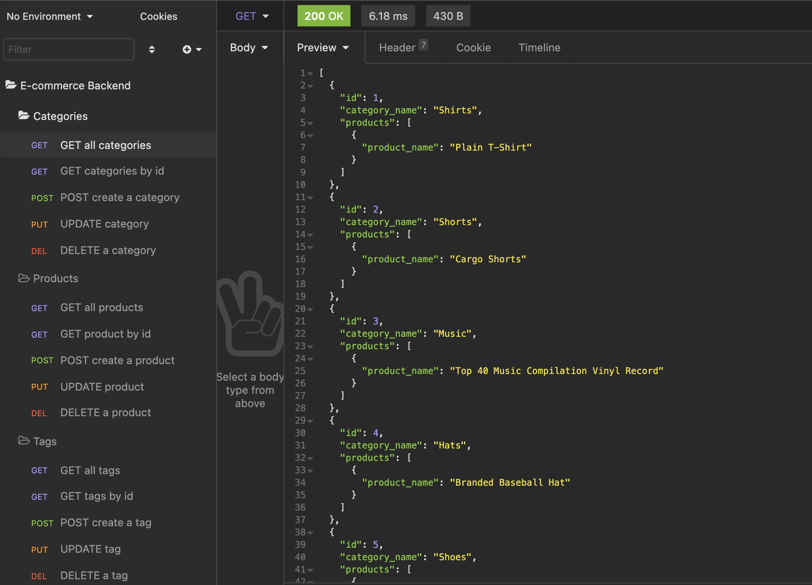

# E-commerce Back End with Object-Relational Mapping (ORM)

### Description 
A backend application that uses a mysql database for an e-commerce site. The user can get, update, delete categories, products or tags. 

### Installation
`npm install` to install all dependencies

### Usage
1. Run `mysql` and `SOURCE db/schema.sql`
2. `npm run seed` to seed the database 
3. `npm start` to start the server 

### Screenshot of Insomnia requests

### Usage and Demo

### Technology
* Node.js
* MySQL
* Sequelize
* Express.js
* Dotenv
